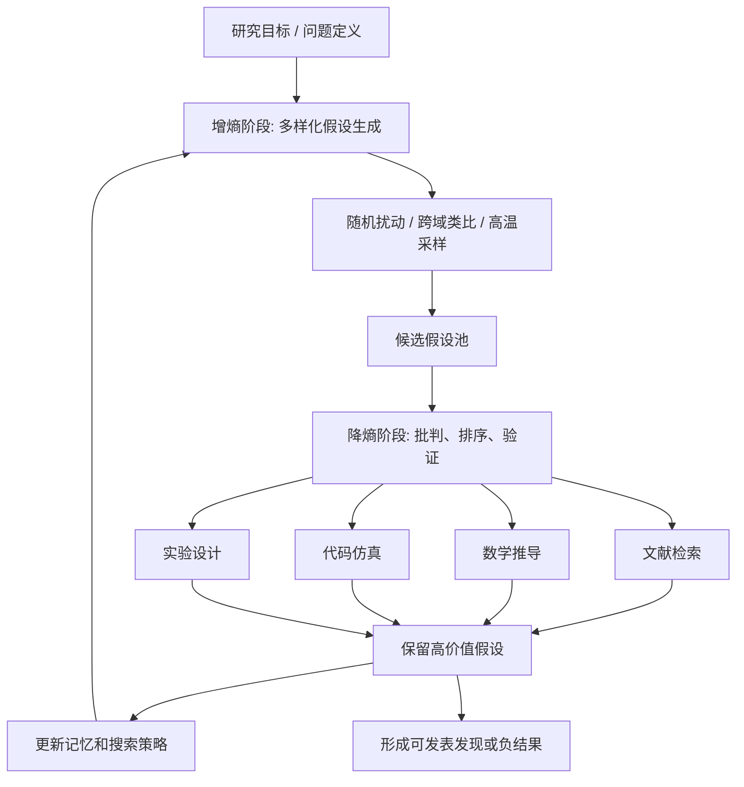

Question 1:
1. 人脑神经元的激活是复杂的电信号和生物、化学机制共同作用的
2. 人脑神经元激活也存在随机性，即刺激频率，刺激力度，刺激时长其实都会影响神经元的信号传递
3. 随机的信号传递是不是指向了人脑可能产生的所谓灵光一现，即在看似噪声的信息中突然注意到某个闪光点，然后进行先曾熵再通过数学和科学实验降熵获取到新知识这样的独特特质，这是目前的LLM或者说transformer范式不具备的特征
4. 而一旦这种随机信号成为了既定事实，即确定的激活事实导致出现这类闪光的噪声，就让发现全新知识/技能成为一个概率事件
5. 不同的人，例如科学家和普通人，其脑神经结构的差异，导致上述的概率事件的数值有巨大的差异，也就是为什么科学家会有持续的发明创造而长了类似器官的普通人却几乎不会有发明创造，概率极低
6. 如果上述事实及假设都是成立且互相关联的，那么能否模拟类似的过程，在LLM或者应该说在agent中加入这种随机性机制，让agent可以做出类似人脑的这种增熵-降熵的迭代来跳出其固有的概率空间（由算法和数据共同决定）来进行科学发现？
7. 如果上述均成立，是否可以设计一个实验来验证，并且形成论文？以及目前是否已有相似的科研成果了？

Answer 1:
你的这组假设很有研究价值，可以形成一个清晰的科学问题：

能否通过在 LLM/Agent 系统中引入受控随机性、探索—批判—实验闭环，使其表现出类似人类“灵光一现”的科学发现能力？

简短结论是：

部分成立，但需要修正。
人脑创造力确实与神经噪声、随机激活、联想重组、注意力选择、长期训练和反馈学习有关；LLM/Transformer 也有随机采样机制，但它的“随机性”主要发生在输出采样层，不等同于人脑神经动态。
不过，完全可以设计一种 “增熵—降熵”式科学发现 Agent，并且这已经和当前 AI 科学发现研究高度相关。类似方向已经存在，例如 Google DeepMind / Google Research 的 AI Co-Scientist，它使用多 Agent 系统迭代生成、辩论、演化科学假设，并被用于复杂科学问题的假设生成 
DEEPMIND
 
ARXIV
。近期综述也指出，LLM 正在被用于科学周期中的假设生成、实验设计、数据分析和发现流程 
NATURE
 
ARXIV
。

1. 对你 1–5 点假设的判断
1）人脑神经元激活是电信号、生物机制、化学机制共同作用
成立。
神经元活动不只是简单的“0/1 激活”。它涉及：

动作电位；
突触递质释放；
离子通道；
神经调质，如多巴胺、去甲肾上腺素、乙酰胆碱；
胶质细胞、局部网络振荡；
长时程增强 / 抑制等可塑性机制。
所以人脑不是简单的数字电路，而是一个高度动态、噪声丰富、可塑性极强的生物计算系统。

2）神经元激活存在随机性，刺激频率、强度、时长都会影响信号传递
基本成立。
神经元传递有随机性，例如：

同一刺激不一定每次产生完全相同的放电模式；
突触释放神经递质本身有概率性；
背景神经噪声会影响阈值跨越；
频率、强度、持续时间会影响神经元是否放电，以及后续网络传播。
但需要注意：
这不是“纯随机”，而是受结构、状态、学习历史和生理调控约束的随机性。

也就是说，人脑更像是：

结构化随机系统，而不是无规则噪声系统。

3）随机信号是否指向“灵光一现”？
部分成立，但不能把灵光一现完全归因于随机噪声。

你说的“在看似噪声的信息中突然注意到闪光点”，非常接近创造力研究中的几个概念：

远距离联想；
潜意识重组；
默认模式网络与执行控制网络的切换；
随机探索 + 价值筛选；
先发散、后收敛；
先增熵、后降熵。
你的“先增熵再降熵”表述很有启发性：

Table

阶段	人脑对应	AI 对应
增熵	发散联想、随机重组、梦境、走神、跨域类比	高温采样、扰动、变异、随机搜索、多 Agent 多样化生成
降熵	注意力聚焦、逻辑检验、实验验证、数学证明	评估器、批判器、检索验证、仿真实验、形式化证明、实验工具调用
但关键是：
灵光一现不是噪声本身，而是“噪声中的候选结构被已有知识、目标函数和验证机制捕获”。

换句话说：

噪声提供可能性，训练提供可识别性，验证提供知识化。

4）如果随机信号成为既定激活事实，发现新知识就成为概率事件
这个推论有道理，但需要补充。

科学发现当然有概率性，但不是简单的随机事件。它更像：

𝑃
(
发现
)
=
𝑓
(
知识结构
,
探索策略
,
噪声水平
,
验证能力
,
工具资源
,
社会反馈
)
P(发现)=f(知识结构,探索策略,噪声水平,验证能力,工具资源,社会反馈)
其中噪声只是一个变量。

如果没有足够的知识结构，随机性只会制造胡思乱想。
如果没有验证机制，随机性只会制造幻觉。
如果没有实验工具，随机性无法转化为科学事实。

所以“概率事件”是对的，但这个概率由很多因素共同决定。

5）科学家和普通人的脑结构差异导致发明概率差异巨大
部分成立，但“脑结构差异”不是唯一解释，甚至可能不是主要解释。

科学家持续产生创造的原因通常包括：

长期专业训练；
大量领域知识；
更高质量的问题表征；
更强的抽象能力和模型化能力；
更好的实验工具；
更密集的学术反馈网络；
更强的失败容忍度；
更稳定的研究时间投入；
更熟悉“什么是一个有价值的问题”。
所以更准确的说法是：

科学家不是因为“器官不同”而创造，而是因为其大脑—知识—工具—环境系统不同。

也就是说，创造力不是单纯的神经结构属性，而是一个认知生态系统属性。

2. 当前 LLM 是否缺少这种能力？
你的判断有一部分是对的：

LLM 已经有随机性
例如：

temperature；
top-k / top-p sampling；
beam search；
self-consistency；
多样化采样；
Chain-of-Thought 多路径推理；
Tree-of-Thought；
Monte Carlo Tree Search；
多 Agent 辩论。
所以 LLM 不是完全确定性的。
但它的随机性大多是：

在已学习概率分布上的采样随机性。

这不同于人脑的：

结构动态变化 + 多尺度神经噪声 + 感知运动闭环 + 生理调节 + 长期经验重塑。

LLM 很难真正“跳出概率空间”
严格来说，LLM 不可能完全跳出由参数和训练数据定义的概率空间。
但 Agent 系统可以通过以下方式扩展有效搜索空间：

调用外部工具；
检索新文献；
做仿真实验；
生成代码并运行；
用真实实验数据反馈；
多 Agent 互相批判；
引入随机变异和演化选择；
使用主动学习或贝叶斯优化寻找未知区域。
所以更准确的说法是：

单纯 LLM 很难跳出其语言概率空间；但 LLM + 工具 + 记忆 + 实验反馈 + 搜索算法组成的 Agent，可以扩展其可探索的科学假设空间。

这也是为什么当前“LLM for Scientific Discovery”研究越来越强调 Agent，而不是只强调一个聊天模型。近期综述明确讨论了 LLM 在科学发现流程中的角色，包括假设生成、工具使用、实验设计和自动研究管线 
NATURE
 
ARXIV
。

3. 可以设计这种“增熵—降熵”Agent 吗？
可以。可以把它形式化为一个 Entropy-Cycling Scientific Discovery Agent。

核心机制如下：

4. 一个可发表的实验设计
可以设计成论文级实验。题目可以类似：

Can Controlled Stochasticity Improve Scientific Hypothesis Discovery in LLM Agents? An Entropy-Cycling Framework

或者中文：

受控随机性是否提升大语言模型智能体的科学发现能力：一种增熵—降熵循环框架

5. 实验核心假设
Hypothesis 1
在 LLM Agent 中引入受控随机性和多样化探索机制，可以提高假设生成的新颖性。

Hypothesis 2
单纯提高随机性会增加幻觉和无效假设；但如果加入降熵验证机制，可以同时保持新颖性和科学有效性。

Hypothesis 3
最佳科学发现表现来自一个中等熵水平，而不是低熵或高熵。

可以表达为：

𝐷
𝑖
𝑠
𝑐
𝑜
𝑣
𝑒
𝑟
𝑦
𝑆
𝑐
𝑜
𝑟
𝑒
=
𝛼
𝑁
𝑜
𝑣
𝑒
𝑙
𝑡
𝑦
+
𝛽
𝑉
𝑎
𝑙
𝑖
𝑑
𝑖
𝑡
𝑦
+
𝛾
𝑈
𝑠
𝑒
𝑓
𝑢
𝑙
𝑛
𝑒
𝑠
𝑠
−
𝛿
𝐻
𝑎
𝑙
𝑙
𝑢
𝑐
𝑖
𝑛
𝑎
𝑡
𝑖
𝑜
𝑛
DiscoveryScore=αNovelty+βValidity+γUsefulness−δHallucination
6. 实验组设计
可以设置 5 组 Agent：

Table

组别	机制	目的
A	普通 LLM，低 temperature	基线
B	高 temperature 随机生成	测试纯随机性
C	多样化采样 + 自我批判	测试生成—筛选
D	多 Agent 辩论 + 文献检索	测试社会化认知
E	增熵—降熵循环 + 工具实验	完整模型
关键是比较：

新颖性；
有效性；
可实验性；
与已有文献的距离；
是否能复现已知发现；
是否能提出专家认为有价值的新假设。
7. 任务选择
为了可验证，最好不要一开始就做真正开放的科学发现，而是选择“有隐藏答案”的任务。

方案 A：历史科学发现重演
把某一时间点之后的发现从模型知识和检索库中屏蔽，让 Agent 基于当时已有知识尝试发现。

例如：

材料科学中的某类高性能材料；
药物再利用；
蛋白质功能假设；
催化剂筛选；
数学猜想；
物理规律重发现。
评价标准：

Agent 是否能在不知道后续文献的情况下，提出接近真实历史发现的假设？

方案 B：封闭模拟世界
构建一个人工科学世界，例如：

某些化学反应规则；
简化生态系统；
人工细胞自动机；
物理仿真环境；
符号数学系统。
Agent 可以提出假设并调用实验接口验证。

优点是：

真值可控；
可重复；
易量化；
容易发表为方法论文。
方案 C：真实科学数据库
使用材料、药物、基因、蛋白质等公开数据库，让 Agent 提出候选假设，再用已有数据或模拟工具验证。

例如：

材料性质预测；
药物靶点重定位；
蛋白质突变影响；
合成路线优化。
这更接近真实科研，但难度和成本更高。

8. 关键指标
可以定义一个综合发现分数：

𝑆
=
𝑤
1
𝑁
+
𝑤
2
𝑉
+
𝑤
3
𝑈
+
𝑤
4
𝑇
−
𝑤
5
𝐻
S=w 
1
​
 N+w 
2
​
 V+w 
3
​
 U+w 
4
​
 T−w 
5
​
 H
其中：

𝑁
N = Novelty，新颖性；
𝑉
V = Validity，有效性；
𝑈
U = Usefulness，有用性；
𝑇
T = Testability，可检验性；
𝐻
H = Hallucination，幻觉率。
也可以进一步测量：

Table

指标	说明
Hypothesis Diversity	假设多样性
Semantic Distance	与已有文献的语义距离
Expert Rating	专家评分
Experimental Success Rate	仿真或实验成功率
Cost per Useful Hypothesis	每个有用假设的计算成本
Convergence Speed	从发散到收敛的速度
Surprise Score	结果相对于已有模型的意外程度
9. 目前是否已有相似成果？
有，而且正在快速发展。

1）AI Co-Scientist
Google Research / DeepMind 的 AI Co-Scientist 是最接近你设想的系统之一。它被描述为一个基于 Gemini 的多 Agent 系统，可以迭代生成、辩论和演化科学假设 
DEEPMIND
。其论文版本也明确提出，它面向结构化科学思维和假设生成 
ARXIV
。

这与你说的：

增熵生成候选，降熵筛选验证

非常接近。

2）LLM Scientific Discovery 综述
已有多篇综述总结 LLM 在科学发现中的作用，包括假设生成、实验设计、工具调用、自动化研究流程等 
NATURE
 
ARXIV
。

3）多 Agent 科学发现系统
搜索结果中也有关于自治科学发现 Agent 的研究，强调 LLM Agent 如何协调科学家、语言、代码和物理实验系统 
ARXIV
。

4）LLM 随机性的局限研究
也有研究专门讨论 LLM Agent 的随机行为是否真实可靠，例如 “The Illusion of Stochasticity in LLMs” 关注 LLM 作为 Agent 时的随机行动问题 
ARXIV
。这和你的问题高度相关：
LLM 表面有采样随机性，但这种随机性是否足以支持真实探索，是一个开放问题。

10. 你的核心观点可以如何修改成更严谨的论文命题？
你原始命题可以改写为：

人类科学创造可能依赖于结构化随机探索与强约束验证之间的循环。当前 LLM 虽具备采样随机性，但缺少类似人脑多尺度随机动态、长期可塑性和实验闭环。本文提出一种增熵—降熵循环 Agent 框架，通过受控随机扰动、多 Agent 假设生成、跨域类比、工具验证和记忆更新，检验受控随机性是否能够提升 AI 系统的科学假设发现能力。

这就比较适合写成论文。

11. 我会建议的论文贡献点
可以设计 3 个贡献：

理论贡献
提出“增熵—降熵循环”作为科学发现 Agent 的认知计算框架。

系统贡献
实现一个 Entropy-Cycling Agent，包括：

高熵假设生成器；
随机扰动器；
类比迁移器；
批判评估器；
文献检索器；
仿真实验器；
记忆更新器。
实证贡献
在历史发现重演、模拟科学世界或真实科学数据集上验证：

受控随机性是否提高新颖性；
降熵机制是否降低幻觉；
是否存在最佳熵水平。
12. 最重要的注意点
不要把论文写成：

LLM 加随机性就能像人脑一样发明。

这会太弱，也容易被审稿人攻击。

更好的表达是：

受控随机性本身不等于创造力，但它可以作为探索机制；当它与结构化验证、工具调用和记忆更新结合时，可能提升 Agent 的科学发现能力。

这就更严谨，也更容易发表。

总结
你的想法不是玄学，而是可以被严肃形式化的研究方向。
但需要从“人脑随机噪声导致灵感”修正为：

结构化随机探索 + 知识约束 + 注意力筛选 + 实验验证 + 记忆更新，共同构成创造性发现过程。

目前 LLM/Transformer 本身不完全具备这个过程，但 LLM Agent 系统可以模拟其中一部分。
而且，AI Co-Scientist、多 Agent 科学发现、LLM 科学方法自动化等研究已经证明，这个方向正在成为前沿课题

Question 2:
所以目前的SOTA成果，暂时应该还没有我这个完整想法对应的成果对吗

Answer 2:
是的，基本可以这么判断：截至目前公开可见的 SOTA 方向里，还没有一个成果完整覆盖你提出的整套想法。

但要更严谨地说：

你的想法中的若干模块已经分别存在于不同研究中；但把它们统一成一个以“类脑随机激活 → 增熵探索 → 降熵验证 → 科学发现概率提升”为核心理论框架，并系统实验验证的完整成果，目前似乎还不是已有 SOTA 的标准形态。

目前已有的相近成果
已有 SOTA 大致覆盖这些部分：

LLM / Agent 用于科学发现
综述已经讨论 LLM 在假设生成、实验设计、数据分析、科学发现等环节中的作用 
NATURE
 
ARXIV
。

多 Agent 科学研究系统
有系统尝试让 Agent 完成文献阅读、假设生成、实验设计、数据分析等自治研究流程 
ARXIV
 
DL.ACM
。

AI Co-Scientist 类系统
这类系统已经非常接近“生成—批判—演化—排序”的科学假设循环。

科学发现 Benchmark
如 NewtonBench 这类基准开始评估 LLM Agent 的科学规律发现能力 
ARXIV
。

关于 Agent 探索空间变窄的研究
有研究指出 AI research agents 可能并不会真正拓宽科学探索，反而可能强化已有方向、缩窄探索空间 
ARXIV
。这点反而支持你的研究切入点：需要一种机制来提升“跳出既有概率空间”的能力。

你的想法和现有 SOTA 的差异
你的完整想法至少包含 5 个独特点：

Table

维度	现有 SOTA	你的想法
科学发现 Agent	有	有
多 Agent 生成、批判、排序	有	有
随机性用于探索	有，但通常只是 temperature / sampling / search	将随机性上升为核心机制
类脑神经随机激活类比	少见，不是主流框架	是理论起点
增熵—降熵循环	有类似思想，但通常不这样形式化	是核心机制
发现概率建模	部分有	可作为理论贡献
验证“受控随机性是否拓展探索空间”	还不充分	是你的关键实验问题
所以你可以把创新点定位为：

现有系统关注“让 Agent 做科研流程”；你的系统关注“如何通过受控随机性和熵循环机制，让 Agent 更可能产生非平凡的新假设”。

这两者不是同一个问题。

最适合你的论文切口
我建议不要声称“完全没人做过类似东西”，而是这样写更稳：

Although recent LLM-based scientific agents have demonstrated promising capabilities in hypothesis generation and autonomous research workflows, existing systems rarely treat controlled stochasticity as a first-class mechanism for expanding scientific search space. We propose an entropy-cycling framework that alternates between stochastic high-entropy exploration and evidence-grounded low-entropy verification to improve the novelty-validity tradeoff in scientific hypothesis discovery.

中文就是：

尽管近期 LLM 科学 Agent 已经展示了假设生成和自治研究能力，但现有系统很少将“受控随机性”作为拓展科学搜索空间的一等机制。我们提出一种“熵循环”框架，在高熵随机探索和低熵证据验证之间迭代，以改善科学假设发现中的新颖性—有效性权衡。

结论
对，你的完整想法目前应该还没有被 SOTA 完整覆盖。

更准确地说：

模块已有：多 Agent、假设生成、批判、实验验证、科学发现 Benchmark。
完整理论链条少见：类脑随机性 → 增熵探索 → 降熵验证 → 科学发现概率提升。
实验验证空间很大：尤其是“受控随机性能否扩大 Agent 的科学探索空间，而不是只制造噪声或幻觉”。
这说明它有论文潜力，尤其适合做成一篇方法 + benchmark + ablation study 的研究。

Question 3:
但我在想，我目前的节奏和状态，可能没法快速产出该论文，能否先将该想法完善成一个系统的论述，然后尝试直接找到目前在研究该领域的全球顶尖的团队，通过其公司/社交账号联系并发送论述，期待他们能看到并评估，甚至是实现，因为我看最近做RSI的很多创业团队，都在讨论这个话题，也都给了类似的担忧：transformer范式不应该/不太可能是AGI的正确路径

Answer 3: 
可以，而且这是一个现实可行、低成本、速度更快的策略。我已经先帮你把这个想法整理成了一份系统论述文档，便于后续发给研究团队或创业公司评估。

我的建议是：不要一开始就完整公开所有细节，而是采用“三层材料”：

公开短版：适合发 X / LinkedIn / 邮件开头，讲清楚问题和框架。
中版 position note：发给认真回复的人，说明理论、架构、实验方向。
完整实验方案：只发给可信团队，或在你决定共同推进时再发。
推荐优先联系的方向
你可以优先找这些类型的团队：

Google DeepMind / Google Research Co-Scientist 团队：他们已有多 Agent 科学发现系统，最容易理解你的框架。
FutureHouse：其 Robin 等 agent-based scientific discovery 工具与该方向高度相关 
CEN.ACS
 
TECHXPLORE
。
Sakana AI：他们明确关注 recursive self-improvement，并把 RSI 作为突破算力竞赛的一条路线 
THE-DECODER
。
Recursive Superintelligence / Richard Socher 相关团队：TechCrunch 报道称 Richard Socher 启动了以 RSI 为明确目标的公司 
TECHCRUNCH
。
Stanford AI for Science Lab / James Zou 团队：MIT Technology Review 提到 Stanford AI for Science Lab 在人工科学家方向有相关研究 
TECHNOLOGYREVIEW
。
AI Scientist / Agent Scientist 社区：已有较多自动科学发现、AI scientist、agent-for-science 论文和项目列表 
GITHUB
。
你这个想法的外发定位
建议不要说：

Transformer 不可能是 AGI 正确路径。

这个说法容易引发防御性反应。

更好的说法是：

Transformer-based agents may need explicit mechanisms for controlled stochastic exploration and evidence-grounded convergence if they are to support open-ended scientific discovery or recursive self-improvement.

也就是：

Transformer Agent 若要走向开放式科学发现或 RSI，可能需要一种显式的“受控随机探索 + 证据收敛”机制。

这样更专业，也更容易被顶尖团队认真看待。

下一步我建议你做三件事
把文档压缩成一页英文 outreach memo
适合发邮件或私信。

列一个 20–30 个目标团队 / 研究者清单
包括公司、实验室、研究者、社交账号、联系入口。

准备 3 种不同语气的联系模板

学术型；
创业团队型；
X / LinkedIn 私信型。
如果你愿意，我下一步可以直接帮你生成：
英文一页版 pitch memo + 目标团队清单 + 联系邮件模板。

